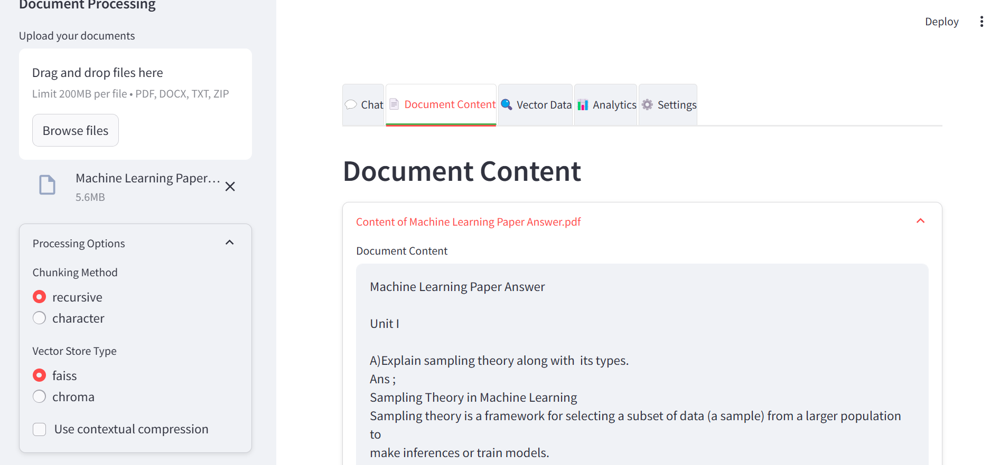
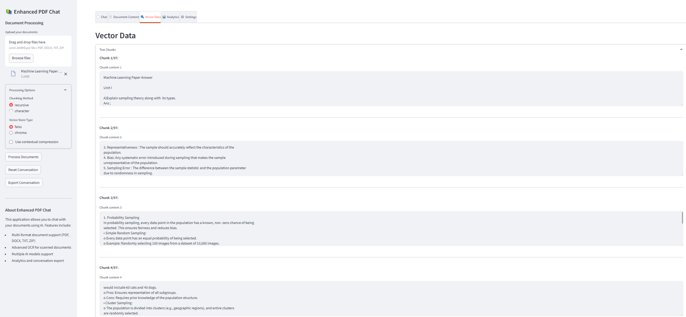

# Enhanced PDF Chat

A Streamlit-based application that allows users to upload documents (PDF, DOCX, TXT, ZIP), process them using advanced text extraction and OCR, and interact with their content through a conversational AI interface powered by language models and vector stores.

## Table of Contents
- [Features](#features)
- [Demo](#demo)
- [Installation](#installation)
- [Usage](#usage)
- [Requirements](#requirements)
- [Project Structure](#project-structure)
- [Contributing](#contributing)
- [License](#license)

## Features
- **Multi-Format Document Support**: Upload and process PDF, DOCX, TXT, and ZIP files.
- **Advanced OCR**: Extract text from scanned PDFs using Tesseract OCR with image preprocessing.
- **Text Chunking**: Split documents into manageable chunks using recursive or character-based methods.
- **Vector Stores**: Create embeddings with FAISS or Chroma for efficient retrieval.
- **Conversational AI**: Chat with documents using Google Gemini or OpenAI models.
- **Analytics**: View response time, conversation statistics, and feedback distribution.
- **Export**: Download conversation history as Markdown.
- **Customizable Settings**: Adjust LLM, embedding models, chunking methods, and more.

## Demo
Below are some screenshots showcasing the application's functionality:

# Project Title

## Chat Interface


## Document Content View


## Analytics Dashboard



## Installation
To run this project locally, follow these steps:

1. **Clone the Repository**
   ```bash
   git clone https://github.com/your-username/enhanced-pdf-chat.git
   cd enhanced-pdf-chat
   ```

2. **Set Up a Virtual Environment**
   ```bash
   python -m venv venv
   source venv/bin/activate  # On Windows: venv\Scripts\activate
   ```

3. **Install Dependencies**
   ```bash
   pip install -r requirements.txt
   ```

4. **Install Tesseract OCR**
   - On Ubuntu: `sudo apt-get install tesseract-ocr libtesseract-dev`
   - On Windows: Download and install from [Tesseract OCR](https://github.com/tesseract-ocr/tesseract), then add it to your PATH.
   - On macOS: `brew install tesseract`

5. **Set Up API Keys**
   - Create a `.streamlit/secrets.toml` file in the project root:
     ```toml
     [secrets]
     OPENAI_API_KEY = "your-openai-api-key"
     GOOGLE_API_KEY = "your-google-api-key"
     ```
   - Replace the placeholders with your actual API keys.

6. **Run the Application**
   ```bash
   streamlit run app.py
   ```

## Usage
1. **Upload Documents**: Use the sidebar to upload one or more documents (PDF, DOCX, TXT, ZIP).
2. **Process Documents**: Click "Process Documents" to extract text, create chunks, and build a vector store.
3. **Chat**: Navigate to the "Chat" tab and ask questions about your documents.
4. **Explore Tabs**:
   - **Document Content**: View extracted text from uploaded files.
   - **Vector Data**: Inspect text chunks and embedding details.
   - **Analytics**: Analyze response times and conversation stats.
   - **Settings**: Customize LLM, embeddings, and chunking options.
5. **Export**: Export your conversation history from the sidebar.

## Requirements
The project dependencies are listed in `requirements.txt`. Key libraries include:
- `streamlit`
- `PyPDF2`
- `langchain`
- `langchain-huggingface`
- `langchain-community`
- `pytesseract`
- `pdf2image`
- `pillow`
- `plotly`
- `matplotlib`

Create a `requirements.txt` file with:
```bash
pip freeze > requirements.txt
```
after installing all dependencies.

## Project Structure
```
enhanced-pdf-chat/
├── app.py              # Main application file
├── image1.png          # Demo screenshot of chat interface
├── image2.png          # Demo screenshot of document content
├── image3.png          # Demo screenshot of analytics
├── requirements.txt    # Project dependencies
├── .streamlit/
│   └── secrets.toml    # API keys (not tracked in git)
└── README.md           # This file
```

### Adding Demo Images
1. **Capture Screenshots**:
   - Take a screenshot of the chat interface (`image1.png`).
   - Take a screenshot of the document content tab (`image2.png`).
   - Take a screenshot of the analytics tab (`image3.png`).
2. **Place Images**:
   - Save these images in the root directory of your project alongside `app.py`.
3. **Verify Paths**:
   - The README references these images as `image1.png`, `image2.png`, and `image3.png`. Ensure the filenames match exactly.

## Contributing
Contributions are welcome! To contribute:
1. Fork the repository.
2. Create a new branch (`git checkout -b feature/your-feature`).
3. Make your changes and commit (`git commit -m "Add your feature"`).
4. Push to your branch (`git push origin feature/your-feature`).
5. Open a Pull Request.

## License
This project is licensed under the MIT License. See the [LICENSE](LICENSE) file for details.

---

### Steps to Add to GitHub
1. **Initialize a Git Repository** (if not already done):
   ```bash
   git init
   git add .
   git commit -m "Initial commit with Enhanced PDF Chat application"
   ```

2. **Create a GitHub Repository**:
   - Go to GitHub, create a new repository named `enhanced-pdf-chat`, and don’t initialize it with a README.

3. **Link Local Repository to GitHub**:
   ```bash
   git remote add origin https://github.com/your-username/enhanced-pdf-chat.git
   git branch -M main
   git push -u origin main
   ```

4. **Add Demo Images**:
   - Place `image1.png`, `image2.png`, and `image3.png` in the root folder.
   - Add and commit them:
     ```bash
     git add image1.png image2.png image3.png
     git commit -m "Add demo screenshots"
     git push origin main
     ```

5. **Create `requirements.txt`**:
   - Run `pip freeze > requirements.txt` in your virtual environment to generate the file.
   - Add and commit it:
     ```bash
     git add requirements.txt
     git commit -m "Add requirements.txt"
     git push origin main
     ```

6. **Add README**:
   - Copy the README content above into a file named `README.md` in your project root.
   - Add and commit:
     ```bash
     git add README.md
     git commit -m "Add README with project details and demo images"
     git push origin main
     ```
